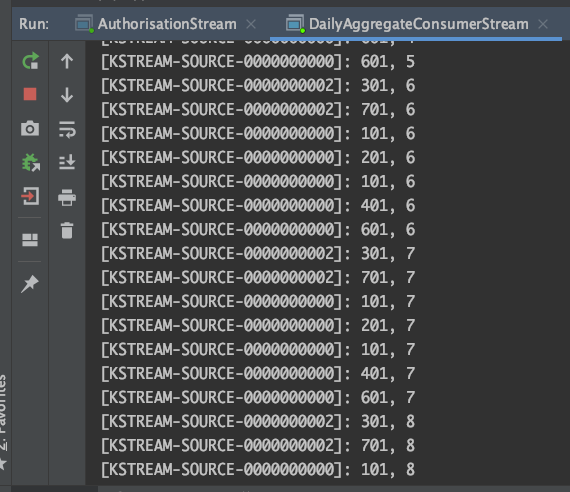
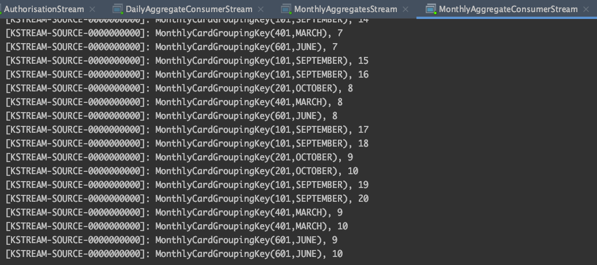

## Card Payments Streams
The project contains a potential solution for streaming credit card transactions and authorization responses and producing daily and monthly aggregated metrics for it.

---

## Problem
We have credit card transaction data flowing in from a source. We have another credit card payment gateway event which gives the information if the transaction actually went through.
i.e; the payment gateway would give you the information for each transaction id, if the actual payment was successful, declined or undefined.
The delay to get the event from the credit card payment gateway could range from 0 seconds to 5 hours.
For each successful and declined transaction, we need to send a notification to the customer with the payment status.
We need to generate a daily report with the total number of successful transactions and the total number of declines transactions for a card We need to get a monthly report on the percentage of successful transactions and declined transactions
We also need the average monthly spend (Consider only the successful transactions) using the credit card in the monthly report
Implement the generation of daily and monthly reports.

---
Table of Contents

* [Requirements](#requirements)
* [Tech Stack](#tech-stack)
* [Packaging and running](#packaging-and-running)
* [Parking Lot](#parking-lot)
* [Improvements](#improvements)

---

<a name="requirements"/>

### Requirements
* You need to have docker installed to run the program using docker-compose
* You will need to install Kafka binaries locally if you want to run it locally
  * Note: Currently, the application has been tested only with local kafka installation.

<a name="tech-stack"/>

### Tech Stack
* Scala version 2.11
* SBT version 1.2.8
* Docker
* MySQL Database
* Kafka version 2.2 (using KStream & KTable APIs)
* Kafka Connect

<a name="packaging-and-running"/>

### Packaging and running
* You need to run `sbt assembly` to create the assembly JAR for the application
* You can run the program via docker using the below command, however, this is still not fully tested
```
docker-compose -f docker-compose.yml up -d
```
* You can also run the program locally without docker by installing kafka binaries from `https://kafka.apache.org/downloads`
* After installing Kafka locally, use the script `run-kafka.sh` from the `bin` directory of Kafka installation to start all services.
* When running locally, the following order should be observed for running each part of the application:

1. Producers
   1. CardTransactionProducer: This producer creates card transactions
   2. PaymentGatewayProducer: This producer creates payment gateway events
2. Consumers
   1. AuthorizedTransactionConsumer: This consumer listens to incoming payment gateway responses to send notifications
3. Producer Streams
    1. AuthorisationStream: This stream joins the incoming data from the above 2 producers and writes to different topics for metrics calculation
    2. DailyAggregatesStream: This stream writes data to different topics after producing daily metrics for card transactions
    3. MonthlyAggregatesStream: This stream writes data to different topics after producing monthly metrics for card transactions
4. Consumer Streams
    1. DailyAggregateConsumerStream: This stream consumes data from topics written by `DailyAggregatesStream`
    2. MonthlyAggregateConsumerStream: This stream consumes data from topics written by `MonthlyAggregatesStream`





### Cleanup
* If you don't have any other docker containers running, you can shut down the ones for this project with the following command:
```
docker stop $(docker ps -aq)
```
* To shut down locally running Kafka services, use the script `kill-kafka.sh`

<a name="parking-lot"/>

### Parking Lot
* Unit testing streams logic
* Using Kafka Connect to sink out the aggregate metrics to an external storage (e.g:Postgres/MySQL)
* Add a REST API to read the metrics values
* Use a config library (e.g. pureconfig) to specify windows, timeouts etc
* Add logging
* Fix docker compose setup
* Use of EnumEntry instead of strings

<a name="improvements"/>

### Improvements
* Use confluent kafka
* Use schema registry
* Use avro format
